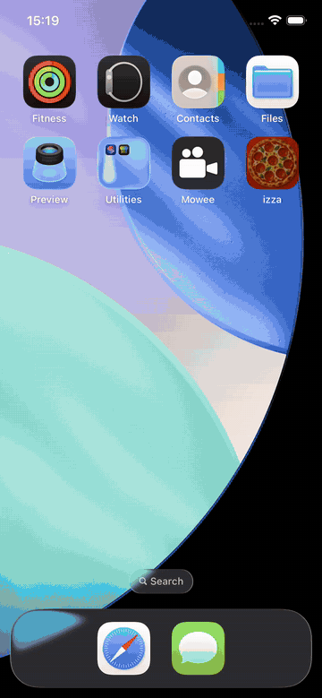

# Izza

Izza is a SwiftUI implementation of an interactive pizza catalogue created for the [C-Punks iOS developer assessment](https://www.work.ua/jobs/8019465/). The project follows the supplied Figma design and focuses on responsive layout, fluid interaction, and a small, clearly separated data layer.

## Demo



## Features

- Eight-frame animated splash screen synchronized with the initial API request
- Snapping horizontal carousel for browsing pizzas
- Asynchronous high-resolution image loading with loading, error, and crossfade states
- Animated S, M, and L size selection
- Variant-specific pricing loaded from the API
- Live total calculation based on the selected size and quantity
- Interactive high-resolution pizza zoom
- Responsive geometry based on the available screen width
- Error state for failed data loading

## Architecture

The app uses an MVVM-style presentation layer with protocol-based repositories:

- `DetailsView` renders the catalogue and user interactions.
- `DetailsViewModel` owns selection, size, quantity, favourite state, and total-price calculations.
- `DetailsRepository` retrieves and exposes pizza data.
- `NetworkClient` provides a reusable async/await networking pipeline with endpoints, decoders, errors, and interceptors.
- `MockDetailsRepository` supplies deterministic data for SwiftUI previews.

The project has no third-party dependencies.

## API and design

- [Pizza API](https://oursongapp.com/api/pizzas)
- [Figma design](https://www.figma.com/design/vV9GJZrUfNi0C3pGt94d3P/TEST--Pizza-Mobile-App?node-id=25-448)
- [Original task description](https://www.work.ua/jobs/8019465/)

## Running the project

1. Clone the repository.
2. Open `izza.xcodeproj` in Xcode.
3. Select an iPhone simulator.
4. Build and run the `izza` scheme.

An internet connection is required to load the catalogue and remote pizza images.

## Project structure

```text
izza/
├── Extensions/       SwiftUI animations and visual modifiers
├── Network/          API models, endpoints, and networking core
├── Resources/        Fonts, colours, images, and app assets
├── ReusableViews/    Shared controls and navigation components
├── Scenes/
│   ├── Details/      Pizza catalogue, view model, and repository
│   └── Splash/       Animated launch sequence
└── Utilities/        Design system and logging utilities
```
